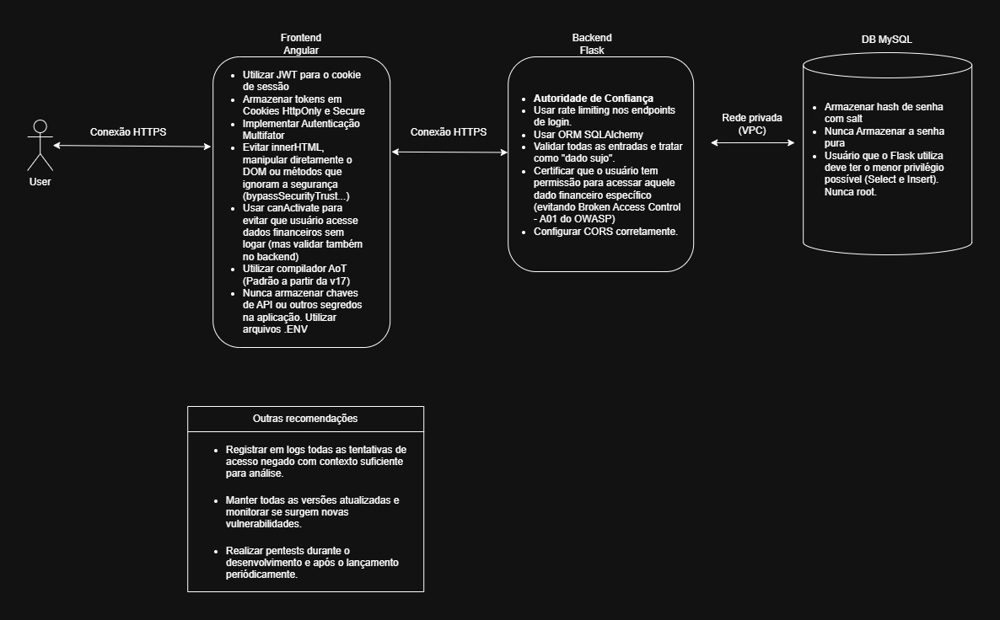
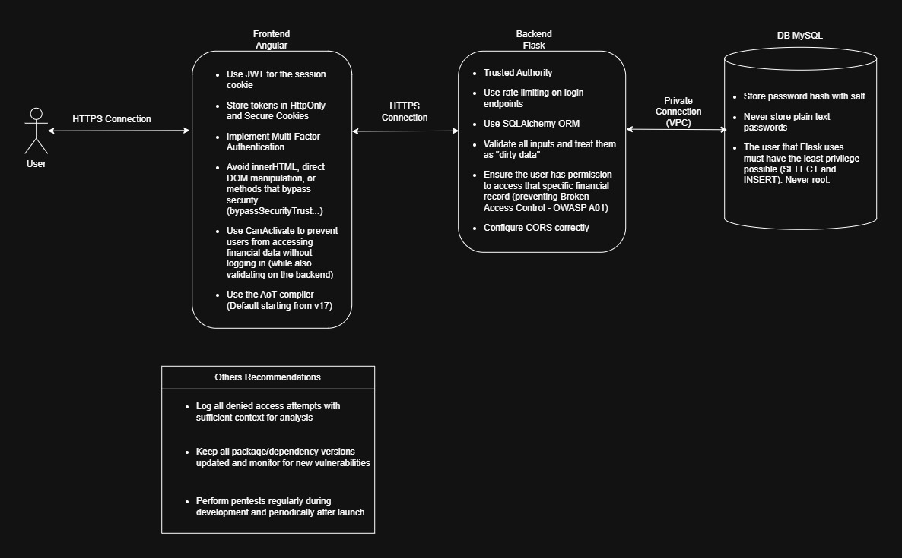

# Gemini Notebook - Cybersec

[Project Link - NotebookLM](https://notebooklm.google.com/notebook/9f88ee8c-fc6d-4368-94af-df162ad71325)

## Objetivo / Objective
(PT-BR) Criar um segundo cérebro que me auxilie nos estudos de segurança da informação e que me ajude no desenvolvimento de aplicações web seguras. Utilizei o NotebookLM para me ajudar a criar uma arquitetura de um sistema de login utilizando Angular para o frontend, Flask para o backend e MySQL para o banco de dados.

(EN) Building a second brain to assist me in my information security studies and to help me develop secure web applications. I used NotebookLM to help me design a login system architecture using Angular for the frontend, Flask for the backend, and MySQL for the database.

## Fontes de Vídeo / Video Sources
https://www.youtube.com/watch?v=aGVN6aHKkE0
https://www.youtube.com/watch?v=6nEnflzVQ80
https://www.youtube.com/watch?v=CCp30BD9uRo
https://www.youtube.com/watch?v=OzBy8nYLY-I
https://www.youtube.com/watch?v=2LYPyUk-L0k
https://www.youtube.com/watch?v=NRDHFUuzZkU
https://www.youtube.com/watch?v=eOsGqXy2vmA
https://www.youtube.com/watch?v=HMqWhI94xao

## Fontes de Texto / Text Sources
https://owasp.org/Top10/2025/
https://owasp.org/Top10/2025/A01_2025-Broken_Access_Control/
https://owasp.org/Top10/2025/A02_2025-Security_Misconfiguration/
https://owasp.org/Top10/2025/A03_2025-Software_Supply_Chain_Failures/
https://owasp.org/Top10/2025/A04_2025-Cryptographic_Failures/
https://owasp.org/Top10/2025/A05_2025-Injection/
https://owasp.org/Top10/2025/A06_2025-Insecure_Design/
https://owasp.org/Top10/2025/A07_2025-Authentication_Failures/
https://owasp.org/Top10/2025/A08_2025-Software_or_Data_Integrity_Failures/
https://owasp.org/Top10/2025/A09_2025-Security_Logging_and_Alerting_Failures/
https://owasp.org/Top10/2025/A10_2025-Mishandling_of_Exceptional_Conditions/
https://cartilha.cert.br/livro/cartilha-seguranca-internet.pdf
https://nvlpubs.nist.gov/NISTpubs/Legacy/SP/NISTspecialpublication800-115.pdf

# Chat

### PT_BR
[chat-pt-br](./chat-pt-br.md)

### EN
[chat-en](./chat-en.md)

# Resultado / Result

### PT-BR

### EN

